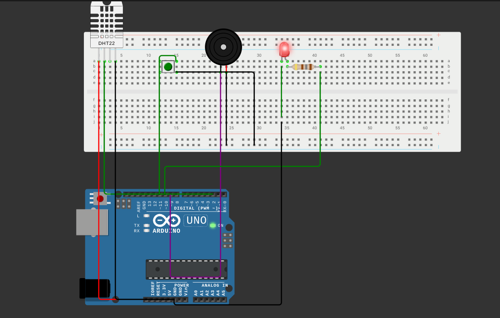

# IOT - GPSMottu 

[Vídeo demonstrativo da solução](https://youtu.be/4bZLAtOSI-M)

## Descrição da Solução:
O Java API - Gestão de Motos é uma aplicação com foco em auxiliar operadores e gestores de filiais no controle e monitoramento de motos, funcionários e setores da empresa.

O sistema oferece funcionalidades para:

-	Gestão de motos: cadastro, atualização de status e rastreamento em diferentes filiais.
-	Controle via QR Code: associação de motos a QR Codes, permitindo rápida identificação e verificação no momento de entrada, saída ou movimentação.
-	Mapeamento de setores e filiais: estruturação de áreas internas da empresa para facilitar a localização e organização.
-	Gestão de funcionários: registro de colaboradores vinculados a cada filial, integrando informações relevantes para a operação.

## Benefícios para o Negócio

Com essas funcionalidades, a empresa consegue implementar um controle mais eficiente sobre as motos e sua localização, alcançando objetivos estratégicos como:
-	Redução de perdas e prejuízos: evitar que motos sejam extraviadas ou deixem de ser monitoradas.
-	Melhor comunicação interna: facilitar a troca de informações sobre a frota entre funcionários e gestores.
-	Maior rastreabilidade: garantir que cada moto esteja sempre associada a uma filial, setor e responsável.


Esse projeto foi feito com Wokwi simulando Arduino + Protoboard + Led + Buzzer + Sensor DHT22 (Temperatura e Umidade).

O código à ser executado está presente em `src/main.cpp`.


O fluxo principal que eu espero que você use é:

- Abra o `diagram.json` na raiz do projeto no VS Code;
- Use a extensão do Wokwi (ou o Wokwi CLI) para executar a simulação a partir desse `diagram.json` — a extensão transforma o `diagram.json` em uma simulação executável dentro do VS Code e permite interagir com botões, displays e outros componentes.

Este README mantém também instruções para configurar o ambiente (PlatformIO e Wokwi) e para trabalhar com a placa via PlatformIO caso queira compilar/upload localmente.

## Execução pelo site do wokwi

1) Entre e logue no site `https://wokwi.com`

- adicione o codigo main.cpp no sketch.ino
- adicione as bibliotecas do libraries.txt no site
- Adicione o diagram.json

- Após isso rodar o projeto, esperar compilar e testar

### Testes
- Testar requests
- Atenção precisa do token baerer, está no .txt junto com a entrega
#### Links
- GET - https://api.thinger.io/v3/users/felipeRibeiro12981957420984/devices/esp32_dht/resources/stats

- Resposta
```
{
    "estacionamento": 0,
    "garagem": 1,
    "oficina": 2,
    "patio": 2,
    "rua": 1,
    "total": 6
}
```

- GET - https://api.thinger.io/v3/users/felipeRibeiro12981957420984/devices/esp32_dht/resources/temp

- Resposta
```
{
    temperatura: 23.098429
}
```

- GET - https://api.thinger.io/v3/users/felipeRibeiro12981957420984/devices/esp32_dht/resources/motos

- Resposta
```
{
    "m0": {
        "condicao": "Em uso",
        "descricaoDeEstado": "Disponivel para uso",
        "distrito": {
            "nome": "Patio",
            "posicaoX": -73.55049896240234,
            "posicaoY": -46.63330078125
        },
        "id": 0,
        "nome": "Sport"
    },
    "m1": {
        "condicao": "Parada",
        "descricaoDeEstado": "Aguardando documentacao",
        "distrito": {
            "nome": "Patio",
            "posicaoX": -73.55049896240234,
            "posicaoY": -46.63330078125
        },
        "id": 1,
        "nome": "Sport"
    },
    ...
    "total": 6
}
```
- POST - https://api.thinger.io/v3/users/felipeRibeiro12981957420984/devices/esp32_dht/resources/ligarLedMoto

- Body
```
{
    "in": 0 ou 1
}

```

- Resposta
```
{
    "message": "Led e buzzer da moto desligado!"
}

```


## RESULTADOS OBTIDOS

Aqui estão alguns resultados obtidos via terminal:
```bash
Sistema iniciado
Toggle! Novo estado: LIGADO
Temperatura: 24.00 °C
Umidade: 40.00 %
Temperatura: 24.00 °C
Umidade: 40.00 %
Toggle! Novo estado: DESLIGADO
Temperatura: 24.00 °C
Umidade: 40.00 %
```



